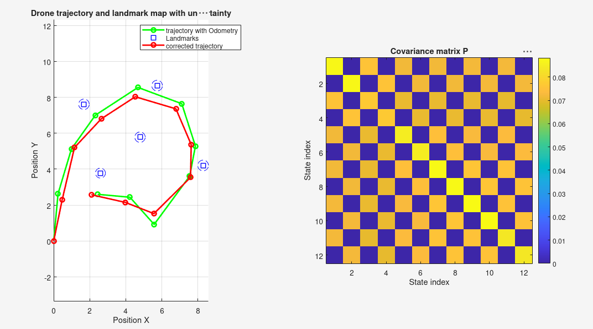

# Full observation

This part addresses the baseline case of Kalman-filter-based SLAM: at every step, **all** landmarks are observed, always in the **same order**. This setting isolates the core mechanics of the filter from the additional complexity of data association.



*Trajectory estimated from odometry alone (green) versus the Kalman-filter-corrected trajectory (red), together with the recovered landmarks and their uncertainty (dashed circles). On the right, the final covariance matrix `P`.*

## Method

The state of the system is a single vector containing both the drone's position and the position of every landmark:

```
X = [x_drone, y_drone, x_landmark1, y_landmark1, ..., x_landmarkN, y_landmarkN]
```

At every step, the filter performs three operations:

1. **Prediction** — the state estimate is advanced using the odometry reading (`pred_odometry.m`)
2. **Observation prediction** — the perception expected from the predicted position is computed (`pred_observation.m`)
3. **Correction** — this prediction is compared with the actual perception, and the state is corrected accordingly (`corr_observation.m`)

The correction step is the core of the Kalman filter:

```
K = P* H' (H P* H' + Py)^-1        % Kalman gain
X = X* + K (Y - Y*)                % corrected state
P = P* - K H P*                    % corrected covariance
```

(`X*`, `P*`: predicted state and covariance; `Y`: actual perception; `Y*`: predicted perception; `H`: observation matrix; `Py`: observation noise covariance)

## Files

| File | Role |
|---|---|
| `main.m` | main script: reads the data and runs the filter |
| `init.m` | builds the initial state `X0`, `P0`, and the matrices `A`, `B`, `H` |
| `pred_odometry.m` | prediction step |
| `pred_observation.m` | predicts the expected perception |
| `corr_observation.m` | correction step |
| `cov_odometry.m` | odometry noise model |
| `cov_observation.m` | observation noise model |
| `print_figure.m` | displays the final result |

## Data

`data/FullObservation.data` alternates perception and odometry lines:

```
percep : 2.610054 3.587491 1.731687 7.627319 5.969606 8.740084 8.536369 4.046501 4.918375 5.744246 
odom : 0.242237 2.635034
percep : 2.059525 1.537290 1.102366 5.364240 5.407859 6.277271 7.850414 1.886459 4.320856 3.534482 
odom : 0.512546 2.822456
...
```

The first perception initializes the map; odometry and perception then alternate to drive the prediction/correction cycle.

## Observations

The final covariance matrix displays a checkerboard pattern: strong correlations only appear between same-axis components (x with x, y with y), never across axes. This directly reflects the noise model — odometry and observation noise are added independently and isotropically to x and y at every step, so no coupling between axes is ever introduced by the filter's own equations.

Final landmark uncertainties also converge to similar, low values across all landmarks. This is expected here, since every landmark is observed at every step and therefore benefits from a comparable number of corrections.

## Running the code

Open `main.m` (the data file is already located in `data/`) and execute it. A single figure is displayed at the end: both trajectories together with the final map and its uncertainty, and the covariance matrix.
