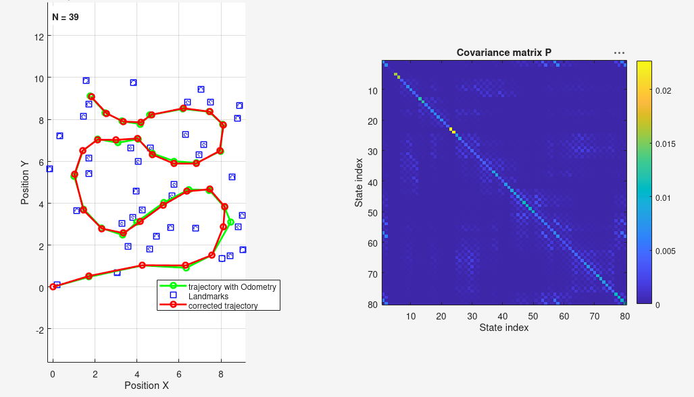
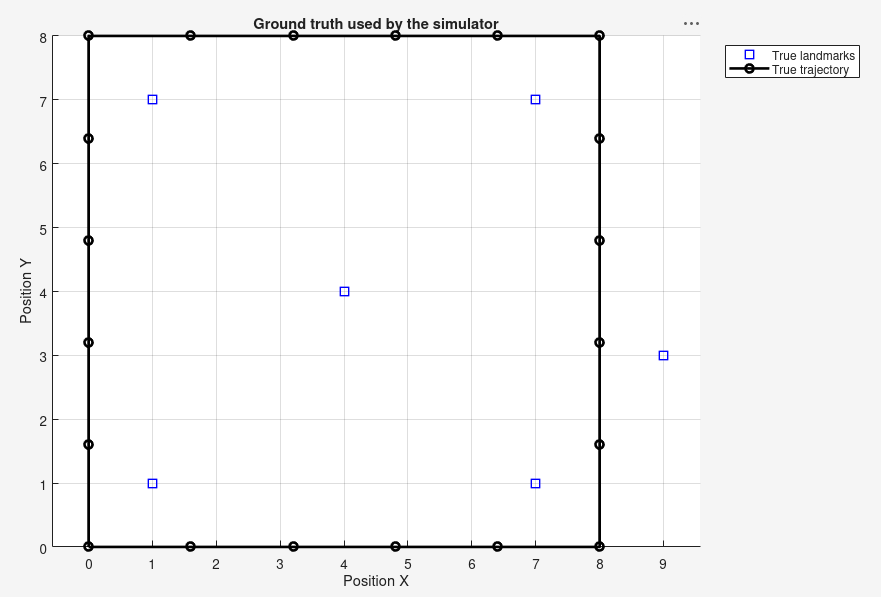
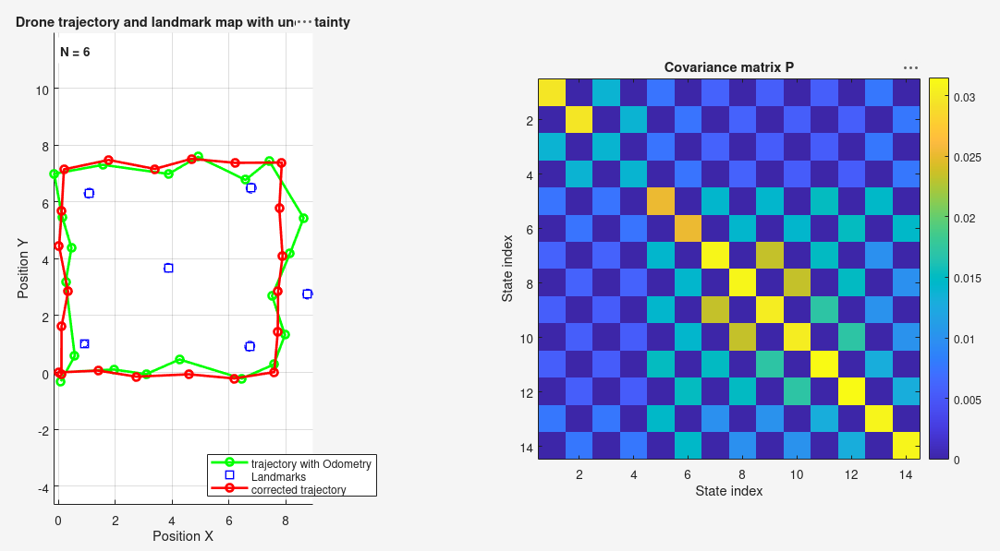
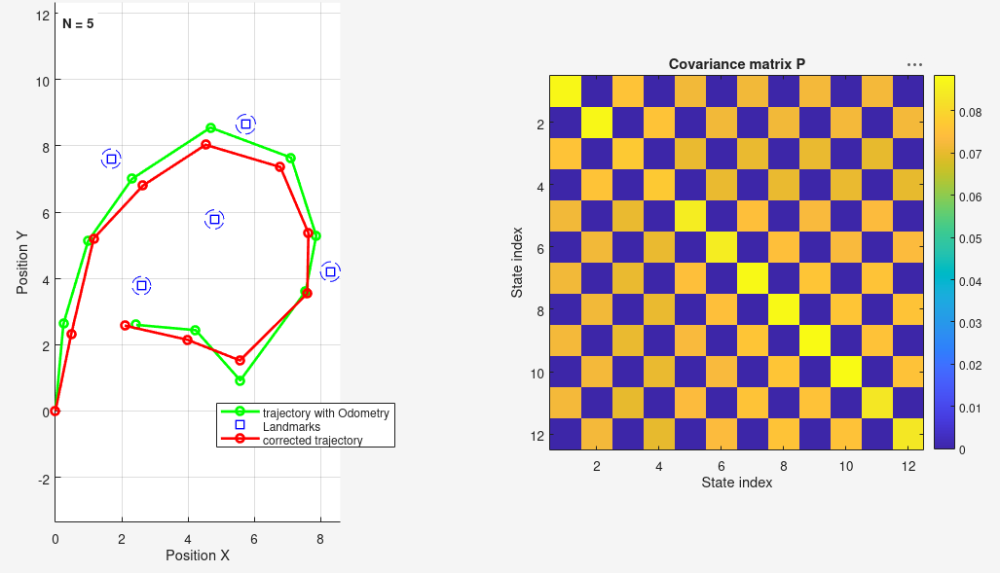

# Partial observation

This part addresses a more realistic SLAM setting: at every step, the drone observes only a **subset** of the landmarks, in an **unknown order**. Before the classical Kalman correction can be applied, each perceived point must first be matched to a known landmark — or identified as a new one.



*Result on `PartialObservation.data` (the project's original dataset), with `thresh = 1` (the default value in `main.m`): 39 landmarks are recovered. In the absence of ground truth for this dataset, this count cannot be independently validated — see the simulator section below for an objective assessment of the threshold.*

## Data association

For each perceived point, the distance to every known landmark (predicted from the drone's position) is computed. If the closest one falls below a threshold `thresh`, the point is considered a re-observation of that landmark and passed to the filter for correction. Otherwise, it is treated as a new landmark, added to the map after correction.

This logic is implemented in `match_landmarks.m`, which builds `H`, `Y_known` (matched points) and `Y_new` (new landmarks) from the raw perception. `update_state.m` then extends the state `X` and covariance `P` to incorporate the new landmarks.

The threshold `thresh` is the most sensitive parameter: too low, and a landmark re-observed with some noise is mistaken for a new one (duplicates); too high, and distinct landmarks may be merged into one. On `PartialObservation.data`, there is no way to objectively validate this choice, since the true number of landmarks is unknown — this is precisely the role of the simulator described below.

## Files

| File | Role |
|---|---|
| `main.m` | main script |
| `init.m` | initial state |
| `pred_odometry.m` | prediction |
| `pred_observation.m` | predicted perception |
| `corr_observation.m` | correction |
| `cov_odometry.m` / `cov_observation.m` | odometry/observation noise models |
| `match_landmarks.m` | data association (new relative to `full_observation`) |
| `update_state.m` | adds new landmarks to the state (new) |
| `simulator.m` / `simulate_perception.m` | generates test data with known ground truth (new) |
| `print_figure.m` | displays the final result |

## Data

`data/PartialObservation.data` follows the same format as in `full_observation`, except that the number of perceived landmarks varies from one line to the next:

```
percep : 0.197343 0.116691 
odom : 1.719368 0.481953
percep : -1.525463 -0.415648 1.334917 0.153515 
odom : 2.542249 0.504055
percep : 0.396366 0.744896 1.026433 1.560395 -0.458501 1.015613 -1.186593 -0.359268 
odom : 2.095067 -0.122511
...
```

## Simulator

To evaluate the filter on a case with a known ground truth (and thereby judge whether the recovered number of landmarks is correct), `simulator.m` generates a synthetic dataset: a drone following a closed square path perceives landmarks within a detection radius `R`, with noise added following the same model as the rest of the project.

The generated file (`data/SimulatedObservation.data`) follows exactly the same format as the real data, so `main.m` reads it without any modification.

| Ground truth | Filter result |
|---|---|
|  |  |
| 6 known landmarks, closed square trajectory. | With `R = 5` and `thresh = 1.5`: all 6 landmarks are recovered exactly (N = 6), with no duplicate. |

Since the true map is known in this case, `thresh = 1.5` can be confirmed as an appropriate setting — unlike on `PartialObservation.data`, where only visual coherence can be assessed, without certainty on the actual number of landmarks.

## Validation against `full_observation`

As a consistency check, this implementation can also be run on `FullObservation.data` (all landmarks observed at every step): the filter should then behave exactly as the simple version from Part 1.



*With `thresh = 1.5`, exactly N = 5 landmarks are recovered — the expected count.*

## Observations

Two points stood out while developing and testing this part.

First, calibrating the simulator itself required some care: an early version placed a landmark at a distance from the square path that was, by construction, always marginally greater than the detection radius `R`. As a result, that landmark was never observed regardless of the threshold used — the limitation was in the data-generation step, not in the association logic. This is a useful reminder that a simulator's own parameters need to be validated before drawing conclusions from downstream results.

Second, the detection radius `R` affects not only the number of recovered landmarks, but also the smoothness of the corrected trajectory. A small `R` spaces out corrections over time, allowing drift to accumulate between two updates and producing a visibly "jumpier" trajectory once a landmark re-enters range. A larger `R` yields more frequent, overlapping corrections and a smoother trajectory.

Finally, the validation against `FullObservation.data` (5 landmarks correctly recovered) confirms that this implementation degrades gracefully to the simple case of Part 1 when all landmarks happen to be observed at every step, in a fixed order.

## Running the code

Open `main.m` (data located in `data/`) and execute it. The threshold `thresh` is hardcoded near the top of the script (`1` by default); it may be raised to `1.5`, the value validated against the simulator's ground truth. To test a new simulated dataset: run `simulator.m` first (it writes to `data/SimulatedObservation.data`), then update the filename opened in `main.m` accordingly.
